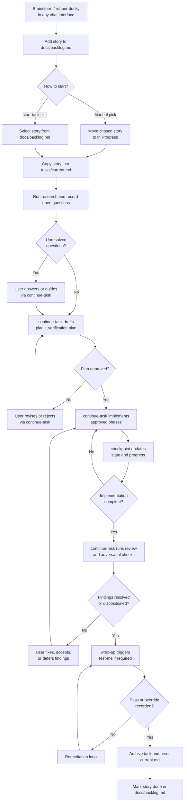

# [Project Name]

> [Short description]

An AI-assisted project template for Claude Code and Codex. It uses repo skills for repeatable workflow steps, keeps active work in `tasks/current.md`, and adds a knowledge-proof gate so implementation work is understood before it is wrapped up.

## Setup

```bash
bash scripts/setup.sh
```

The setup script prompts for project name, description, tech stack, and an optional git remote. It rewrites placeholders in `CLAUDE.md` and `README.md`, configures `core.hooksPath` to `.githooks`, creates a fresh git history, and can optionally push to the new remote.

After setup, fill in the remaining scaffolding:

1. Edit `CLAUDE.md` with project-specific context and conventions.
2. Edit `docs/backlog.md` with prioritised user stories.
3. Add or trim any domain-specific skills in `.claude/skills/` and `.agents/skills/`.
4. Launch Claude Code or Codex and invoke the `start-task` skill.
5. Use `continue-task` to move approved work through planning, implementation, and review.

## Runtime Layout

- Claude Code discovers repo skills in `.claude/skills/`.
- Codex discovers repo skills in `.agents/skills/`.
- Shared deterministic helpers live in `scripts/` and are reused by skills and git hooks.

### Invoking Skills

- In Claude Code, these workflow skills behave like slash-style repo skills such as `start-task`, `continue-task`, and `wrap-up`.
- In Codex, use the skill picker or invoke the relevant skill by name from `.agents/skills/`.

## Workflow

The workflow revolves around `docs/backlog.md`. The backlog is the single intake point for all work. Every task starts as a user story there before it becomes active.

### Populating the Backlog

User stories can be generated through any chat interface. Use a brainstorming conversation to think through requirements, then paste the resulting stories into `docs/backlog.md` using the standard template:

```md
### US-NNN: [Story title]

**As a** [user type]
**I want** [capability]
**So that** [benefit]

**Acceptance criteria:**
- [ ] [criterion]
```

Stories are prioritised top-to-bottom in the Backlog section. When you are ready to start work, either:

- Use the `start-task` skill to activate the next or in-progress story and run the initial research pass.
- Pick a story manually, move it into `## In Progress`, and copy it into `tasks/current.md`.

Either path leads into the same lifecycle: activate, research, clarify, plan, implement, review, verify understanding, and wrap up.

### Task Lifecycle



### User-Facing Skills

| Skill | Purpose |
|-------|---------|
| `start-task` | Select the next or active backlog item, populate `tasks/current.md`, run the initial research pass, and stop at the first human decision point. |
| `continue-task` | Resume from task state, draft the plan, implement approved work, and coordinate review before wrap-up. |
| `wrap-up` | Finalise the task, trigger the understanding gate at the right point, archive the task note, and reset `tasks/current.md`. |

### Helper Skills

| Skill | Purpose |
|-------|---------|
| `research` | Scan the repo for relevant files, patterns, constraints, open questions, and proposed answers. |
| `plan-task` | Turn research into an approval-ready implementation plan. |
| `test-matrix` | Define the explicit verification plan before wrap-up. |
| `checkpoint` | Reconcile the plan in `tasks/current.md` with the actual repo state and update task state. |
| `update-references` | Refresh `docs/scriptReferences.md` from the current scripts, queries, and handlers. |
| `test-me` | Run the knowledge-proof workflow and record understanding, gaps, and remediation. |
| `follow-up-triage` | Turn accepted risks, deferred findings, and override debt into visible follow-up work. |

### Key Principles

- `tasks/current.md` is the single source of truth for the active task.
- Let `start-task` perform activation and initial research.
- Let `continue-task` advance the task from clarification to plan approval to implementation and review.
- Research before planning. Document what exists and attempt answers before asking the user.
- Plan before coding. Break work into phases and stop for explicit approval.
- Review before wrap-up. Findings must be fixed, accepted, or deferred explicitly.
- For implementation work, do not wrap up without either a passing knowledge-proof result or an explicit override note.
- Keep backlog state, archived tasks, and script references aligned with the codebase.

### Human Break-Free Points

The workflow is designed to automate the routine steps while preserving a few explicit human decision points:

- after research, if unresolved questions remain
- after the implementation plan is drafted, for approval or guidance
- after review and adversarial findings are recorded, for fix / accept / defer decisions
- during wrap-up, if the knowledge proof fails and remediation or an override decision is required

## Project Structure

```text
.
|-- AGENTS.md                  # Repo agent policy and Codex entry point
|-- CLAUDE.md                  # Project memory for Claude Code
|-- README.md                  # This file
|-- docs/
|   |-- architecture.md        # System architecture overview
|   |-- backlog.md             # Prioritised user stories
|   |-- references.md          # External documentation links
|   |-- scriptReferences.md    # Auto-generated code inventory
|   `-- decisions/
|       `-- 000-template.md    # Architecture Decision Record template
|-- tasks/
|   |-- current-template.md    # Template for tasks/current.md
|   |-- current.md             # Active task note and workflow state
|   `-- completed/             # Archive of finished task notes
|-- issues/                    # Tracked issues and bugs
|-- scripts/
|   |-- setup.sh               # One-time project initialisation
|   |-- check_understanding_gate.py
|   `-- record_understanding.py
|-- .githooks/
|   |-- post-commit            # Task-tracking reminder
|   `-- pre-push               # Understanding and task-state gate
|-- .agents/
|   `-- skills/                # Codex runtime skills
|-- .claude/
|   |-- agents/                # Specialist and review agent prompts
|   |-- hooks/                 # Claude notification hook
|   |-- settings.json          # Claude project settings
|   `-- skills/                # Claude workflow and domain skills
```

## Specialist Agents

The template includes specialist prompt files in `.claude/agents/`:

| Agent | Use Case |
|-------|----------|
| `technical-architect` | System design, technology evaluation, and risk assessment |
| `product-backlog-manager` | User stories, acceptance criteria, and prioritisation |
| `python-feature-dev` | Python feature implementation from specs or requirements |
| `k8s-gitops-architect` | Kubernetes manifests, Helm, Kustomize, ArgoCD, and Flux |
| `code-reviewer` | Independent post-implementation review for bugs, regressions, and test gaps |
| `adversarial-referee` | Destructive challenge pass focused on contradictions, failure paths, and unsafe assumptions |

## Model Guidance

- Default to stronger planning models for research and design, and faster models for straightforward implementation.
- Escalate to deeper reasoning for architectural decisions, debugging, and risk review.
- Compact or restart sessions when context gets crowded.
